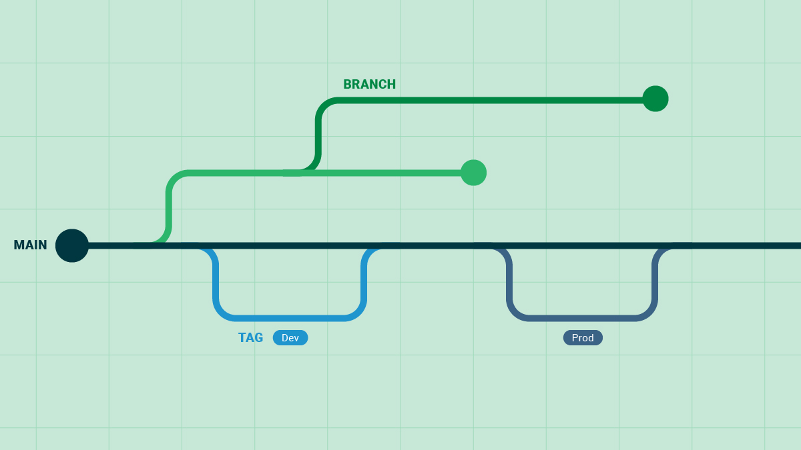

What are Git tags, and how do they differ from branches?
A tag represents a version of a particular branch at a moment in time. A branch represents a separate thread of development that may run concurrently with other development efforts on the same code base.

How can Git tags help in managing and tracking deployments?

        1. Meaningful Tag Names:

Use descriptive and consistent tag names that convey the purpose or significance of each release. Clear naming conventions make it easier to identify and understand the tagged versions.
Consider including version numbers, release names, or relevant identifiers in your tag names. For example, "v1.0.0," "beta-release," or "feature-A-implemented."

    2.Categorization:

Group tags into categories or prefixes to organize them logically. This helps in distinguishing between different types of releases, such as major, minor, or hotfix versions.
Prefixes like "major-," "minor-," or "hotfix-" can be added to the tag names to provide a visual distinction and aid in categorization.

    3. Tagging Conventions:

Establish and adhere to tagging conventions across your team or organization. Consistent practices ensure that everyone understands the meaning and purpose behind the tags.
Document your tagging conventions in a README file or a versioning guide to provide clear guidelines for tag creation and usage.

    4. Tag Deletion or Move:

Occasionally, you may need to delete or move tags to maintain a clean and organized history. For example, if you discover a tag with an incorrect name or misplaced category, you can delete it using the git tag -d command, followed by the tag name.
In case you need to move a tag to a different commit, you can use the git tag -f command, specifying the new commit and the tag name.

    5. Tag Listing and Filtering:

To view a list of existing tags, use the git tag command without any options. This displays all the tags in your repository, sorted alphabetically.
Git provides filtering options to narrow down the displayed tags based on patterns or search criteria. For example, git tag --list "v1.*" lists tags matching the pattern "v1.*", such as "v1.0", "v1.1", etc.

This is a an example that i found in internet about tracking deployments , and kind of i start to a bit understand.
Git tags are markers that point to specific commits in a Git repository. They are used to mark important milestones or versions in the project's history, making it easier to manage and track the codebase over time.

How would you use Git tags to ensure a stable and reliable deployment to the client's production environment?

    Version Tracking:
     Tags allow you to mark specific points in your codebase's history as significant versions. This makes it easy to keep track of different releases and refer back to them when needed. This is essential for creating a clear history of your project's development.

    Stable Release Points:
     When you create a tag, it's usually associated with a commit that represents a stable and tested state of the codebase. These tags mark points in development where the software is considered reliable and ready for deployment.
    
    Deployment References:
     Using tags as deployment references ensures that you're deploying a known, tested, and stable version of the code. This reduces the risk of deploying code that might have been changed since the last deployment.
    
    Reproducibility:
     Tags make it possible to reproduce the exact codebase that was used for a specific deployment. This is crucial for troubleshooting and debugging issues that might arise in the deployed environment.

     Collaboration and Communication:
      Tags provide a clear way to communicate with your team about important milestones, releases, or specific versions that should be used. This shared understanding helps in coordinating efforts and avoids confusion.

    Hotfixes and Patch Releases:
     If a critical issue is discovered in a deployed version, you can create a new tag to represent a hotfix or a patch release. This allows you to address urgent issues while keeping the rest of the codebase unchanged.

     Release Notes: 
     Tags can be accompanied by release notes that detail the changes made in that version. This documentation is valuable for both developers and users to understand what's new or fixed in a release.

     Branching and Development Strategy:
      Tags are often used in combination with branching strategies like GitFlow, where specific branches represent different stages of development (e.g., feature, develop, release, master). Tags can be applied when code from a release branch is merged into the master branch, signifying a new stable release.

      At the point Git tags serve as markers for stable and reliable points in client product environment or in our project`s history. but there is a lot of ways to be sure that our client product`s environment will be stable and reliable deployment.

What steps should your team take to ensure that the client's production environment remains unaffected by ongoing development?

For being sure that our client`s production environment remains unaeffected there is a steps that team can take to achieve to goal.
so lets to list it! 

    Isolate Development and Production Environments:
    *Maintain separate environments for development, testing and production.
    *Use VCS Git to manage code changes and ensure that only tested and approved changes are deployed to production.

    Implement a Continuous Integration and Continuous Deployment (CI/CD) Pipeline:
    *Set up auto  CI/CD pipeline that automatic building , testing and deployment of code changes.
    *Run automated tests (unit , integration and regression tests) as part of Pipelines to show or find a issues early in the development process.

    Feature Branches and Code Reviews:
    *Using feature branches for development works. Each future or bug fix should be developed in its own isolated branch.
    *Implement a code to review process to ensure that code changes meet quality standarts and do not introduce unexpected issues.

    Test Environments:
    *Maintain testing environments that closely mirror the production environment's configuration and dependencies.
    *Test new code changes thoroughly in these environments before promoting them to production.
    
    Staging Environment:
    *Have a staging environment that closely resembles the production environment. This environment is used to validate the entire application before deploying to production.
    *Perform end-to-end testing, user acceptance testing (UAT), and any other necessary checks in the staging environment.

    Feature Flags and Gradual Rollouts:
    *Implement feature flags to control the activation of new features in the production environment.
    *Gradually roll out new features to a subset of users to monitor their impact and catch any unexpected issues.

    Monitoring and Alerting:

    *Implement comprehensive monitoring and alerting systems to track the health and performance of the production environment.
    *Set up alerts for unusual behavior, performance bottlenecks, and errors.

    Rollback Plan:

    *Have a well-defined and tested rollback plan in case a deployment causes unforeseen issues in the production environment.
    *Regularly practice rollbacks to ensure the process is efficient and reliable.   

    Documentation:

    *Maintain clear and up-to-date documentation for the deployment process, environment configurations, and any specific deployment-related steps.

    Communication:

    *Maintain open communication with the client about planned deployments, maintenance windows, and potential impacts.
    *Provide regular status updates on ongoing development, testing progress, and upcoming releases.

    Change Management and Approval:

    *Establish a change management process that requires approval before deploying changes to the production environment.
    *Ensure that all stakeholders, including the client, are aware of and agree to the changes being deployed.

    Backup and Recovery Strategy:

    *Implement a robust data backup and recovery strategy to ensure that data can be restored in case of data loss or corruption.

    By following these steps, development teams can minimize the risk of affecting the client's production environment while delivering reliable and high-quality software. Effective communication, automation, thorough testing, and a focus on stability are key elements in achieving this goal.